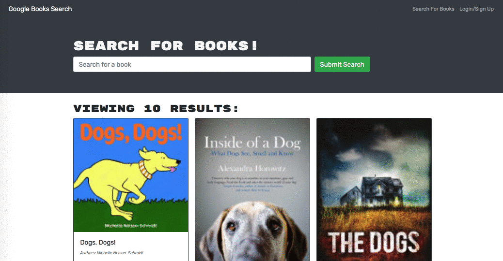

# Look4Book
## Description
A MERN app that uses Google Books API to search for for books. It includes login/signup functionality and the ability to save your books to your profile 
# Table of Contents
* [Technology Used](#technology-used)
* [Usage](#usage)
* [DeployedLinks](#deployed Links)

## Technology Used
- Express.js
- Node.js
- React.js
- GraphQL
- GoogleAPi
- mongoAtlas
- MongoDB
- javascript

## Usage

## Deployed Links
